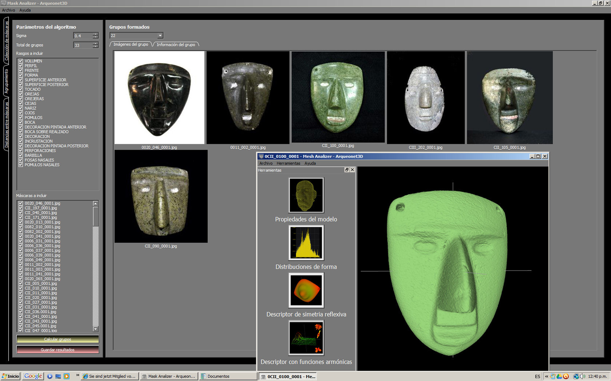

layout: post
title: "Classifying Formal Features of Archaeological Artefacts through the Application of Spectral Clustering"
topics: seminar, 2012/2013, berlin
---
# Classifying Formal Features of Archaeological Artefacts through the Application of Spectral Clustering

Diego Jiménez-Badillo, Salvador Ortíz-Correa and Omar Mendoza-Montoya: **"Classifying Formal Features of Archaeological Artefacts through the Application of Spectral Clustering"**.

**Date:** Tuesday, 06 November 2012

**Time:** 17:00-18:30

**Venue:** [Deutsches Archäologisches Institut, Wiegandhaus, Podbielskiallee 69-71, 14195 Berlin-Dahlem](http://goo.gl/maps/TfRfy). 

A more detailed map of the DAI and surrounding areas can be downloaded from [here](/berlin/files/Anreise_zum_DAI.pdf).

## Abstract
### Authors
* Diego Jiménez-Badillo, Ph.D. National Institute of Anthropology and History (INAH), Mexico <diego.jimenez61@gmail.com>, <diego_jimenez@inah.gob.mx>
* Salvador Ortíz-Correa, Ph.D. Centre for Mathematical Research (CIMAT), Guanajuato, Mexico <src@cimat.mx>
* Omar Mendoza-Montoya, MSc. Centre for Mathematical Research (CIMAT), Guanajuato, Mexico <omendoz@cimat.mx>

This paper is part of a broader project that seeks to introduce the Digital Classicist community with a range of computer and quantitative methods that can be applied for a better understanding of archaeological collections. This comprises, among others, the following research subjects:

* Application of clustering techniques for unsupervised classification
* Acquisition and analysis of 3D digital models of archaeological artefacts
* Automatic recognition of artefact features through the application of computer vision algorithms

Our main objective has been to promote generic methodologies, which can be applied to many other projects. In this occasion we will focus on a new kind of quantitative procedure called Spectral Clustering. This technique uses a graph representation of the original data set in order to analyse the Eigenstructure of its Laplacian matrix. In this way, the clustering problem can be reformulated as that of finding an optimal partition of the graph into disjoint clusters. The main algorithms were developed a decade ago by authors like Alpert, Kahng, and Yao (1999), Shi and Malik (2000), Ng, Jordan and Weiss (2001), Melia and Shi (2001), Zelnik-Manor and Prona (2004), Bach and Jordan (2003, 2006), Azranand and Ghahramani (2006b), Yan et al. (2009), etc. 

To the best of our knowledge, this technique has not been applied before in archaeology despite its proven performance in partitioning a collection of artefacts into meaningful groups. 

We argue that Spectral Clustering yields better results than more traditional approaches such as single and total linkage numerical taxonomy, as well as k-means. The technique is especially useful in exploring archaeological collections because it can analyse categorical data.

As a study case we choose a collection of stone masks found in the Sacred Precinct of Tenochtitlan, the main ceremonial Aztec centre whose remains are located in Mexico City. The schematic features of these objects set them apart from other artefacts with more naturalistic style. This has attracted the attention of many specialists and during the last three decades the typology of these items has been the subject of intense debate. Through the application of Spectral Clustering we were able to segment this collection into well-defined groups, offering better results than previous classifications.

## References
Alpert, C., A. Kahng, and S. Yao. 1999. Spectral Partitioning: The more eigenvectors, the better. Discrete Applied Mathematics, v. 90, pp. 3-26.

Azranand A., Z. Ghahramani. 2006. A new Approach to Data Driven Clustering. In International Conference on Machine Learning (ICML), v.11.

Azranand, A., Z. Ghahramani. 2006. Spectral Methods for Automatic Multiscale Data Clustering. In IEEE Conference on Computer Vision and Pattern Recognition (CVPR).

Bach, F. R., and M. I. Jordan. 2003. Learning Spectral Clustering. Report No. UCB/CSD-03-1249. Computer Science Division (EECS), University of California, Berkeley, California (available at www.cs.berkeley.edu/˜fbach, 2003).
Bach, F. R., and M. I. Jordan. 2006. Learning Spectral Clustering, with Application to Speech Separation. The Journal of Machine Learning Research. V.7: 1963-2001.

Meila, M., and Shi, J.B. 2001. A random walks view of spectral segmentation. In Tenth International Workshop on Artificial Intelligence and Statistics (AISTATS).

Ng, A.Y. , M.I.  Jordan, and Y. Weiss. 2001. On spectral clustering: Analysis and an algorithm. Advances in Neural Information Processing Systems (NIPS), v. 14,

Shi, J., and J. Malik. 2000. Normalized Cuts and Image Segmentation. In IEEE Transactions on Pattern Analysis and Machine Intelligence, v. 22.

Zelnik-Manor, L., and P. Perona.  2004. Self-Tuning Spectral Clustering. Advances in Neural Information Processing Systems, v. 17.
